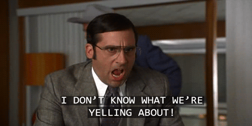
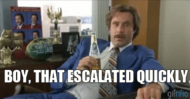
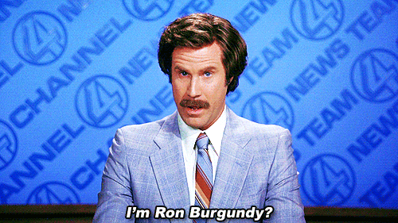
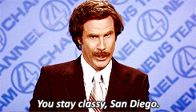

# Anchorman

### Do you think autolayout has to be hard?


Nah. `NSLayoutAnchor` is pretty neat! But it's still a bit tedious of an API. Try writing `.translatesAutoresizingMaskIntoConstraints = true` and `.active = true` 10 times over. But we can make it a bit easier with a *very* thin layer of abstraction.



### How about I show you?

I am a cool developer, making a cool app. It has so many views. I want to pin my view to it's superview.

```swift
myView.pinToSuperview()
```

That was easy, but I don't want to pin to a superview anymore, I want to pin to a button.

```swift
myView.pinToView(someCoolerButton)
```

Ah, ok. Easy enough… How about pinning my label to the left and right side of it's superview… and with insets… and center it in my view.

```swift
MYCAPITALIZEDLABEL.pinToSuperview([ .leading(10.0), .trailing(10.0), .centerY ])
```

Whoa, that was neat! You can specify a group of edges you want to pin to, and their offsets. Swift enums are the best!



And of course, you can pick one edge to pin to another edge.

```swift
myImportantLabel.pinEdge(.top, toEdge: .bottom, ofView: myGreatSearchBar, constant: 10.0)
```

Last but not least, set constant values for your 
constraints. For width, height, or both.

```swift
myView.setSize([ .width(44.0), .height(44.0) ])
```

## Installation
You can use CocoaPods to install Anchorman by adding it to your Podfile:

```swift
platform :ios, '8.0'
pod 'Anchorman'
```

Or install it manually by downloading Anchorman.swift and dropping it in your project.


## About me



Hi, I'm Joe! [@mergesort](http://fabisevi.ch) everywhere on the web, but especially on [Twitter](https://twitter.com/mergesort).

## License

See the [license](LICENSE) for more information about how you can use Anchorman. I promise it's not GPL, because I am not "that guy".

## Fin

Hopefully Anchorman is your cup of tea, it's the kind of autolayout library I'd want to use. And with that, good night San Diego.


